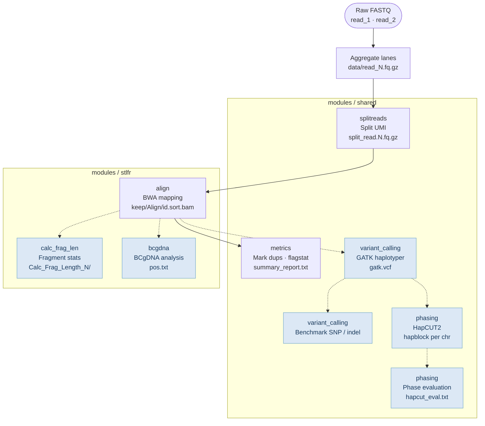
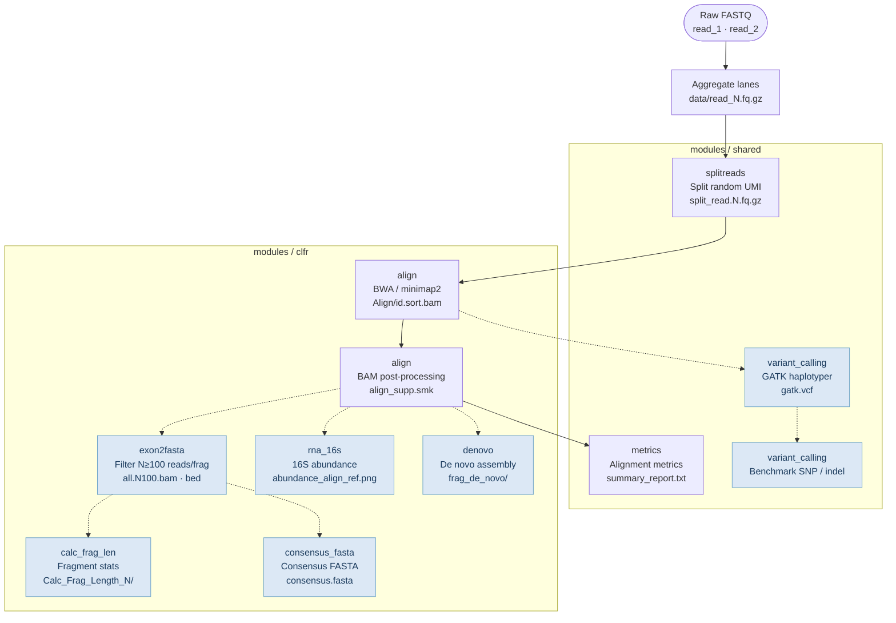

# CGI LFR Pipeline
 
This pipeline is for various CGI LFR (stLFR: Single Tube Long Fragment Read and cLFR: Complete LFR) DNA sequencing applications, with a focus on data drift QC, data cleaning and assay development troubleshooting.   
For production pipeline, see [cWGS](https://github.com/Complete-Genomics/DNBSEQ_Complete_WGS/tree/test?tab=readme-ov-file).  

## Background and Impact

MGI stLFR/cLFR co-barcodes short reads with UMI, achieving pseudo-long-read resolution through UMI-based fragment clustering at standard short-read cost. This makes it attractive for production-scale WGS, but it also introduces additional failure modes: library preparation drift, UMI synthesis quality, and sequencing chemistry variation can all silently degrade data quality before reaching variant calling.

**Why data drift monitoring matters for ML-based variant calling.**
Downstream variant callers such as [Google DeepVariant](https://github.com/google/deepvariant) are deep learning models trained on specific distributions of read pileup features — GC content, coverage depth, duplicate rate, and fragment size. When the input data distribution shifts (assay lot change, reagent update, instrument recalibration), the model operates out-of-distribution, leading to degraded precision/recall without any obvious error signal at the call level.

This pipeline computes a structured set of QC metrics per run to detect such drift early:

| Metric | Drift signal |
|---|---|
| Fragment length distribution (N50, mean, CV) | Library prep consistency |
| Reads-per-UMI distribution | UMI synthesis quality, collision rate |
| Unique UMI fraction | UMI diversity, library complexity |
| GC bias curve (normalised coverage vs GC%) | Sequencing chemistry / PCR bias |
| Duplicate rate (Picard MarkDuplicates) | Over-amplification, insert size shift |
| N≥100 reads/fragment filter pass rate (cLFR) | cLFR clustering efficiency |
| Alignment rate, mismatch rate | Reference compatibility, adapter contamination |

These metrics serve a dual purpose: **operational QC** (flag runs before they enter the variant calling queue) and **feature engineering** (input features for a drift detector or an agentic trigger for automated DeepVariant fine-tuning on freshly labelled data from the drifted distribution).

**Multi-stage data cleaning**
Raw sequencing data contains multiple sources of noise that must be systematically removed before any downstream analysis or ML modelling. The pipeline implements a layered cleaning strategy that mirrors standard ML data preprocessing:

| Stage | Problem | Cleaning method | Module |
|---|---|---|---|
| UMI/UMI extraction | 1–2 bp synthesis errors in 10-mer UMI | Hamming-distance-1 fuzzy matching against the UMI whitelist; unresolvable reads assigned to a null UMI | `shared/splitreads` |
| Deduplication | PCR amplification creates identical read copies that inflate fragment counts and coverage | Picard MarkDuplicates on mapping position + UMI; duplicates flagged, not deleted, preserving the original distribution for downstream inspection | `shared/metrics` |
| Low-quality alignment removal | Multi-mapped and poorly aligned reads introduce noise in fragment boundary estimation | MAPQ ≥ 30 filter (stLFR) / MAPQ ≥ 0 with BC-grouping (cLFR); supplementary and secondary alignments stripped | `stlfr/align`, `clfr/align` |
| UMI collision filtering (cLFR) | Two distinct DNA fragments sharing a UMI by chance produce a chimeric pseudo-fragment | N ≥ 100 reads/UMI filter (`exon2fasta`): collision probability under a birthday-problem model drops below 1% above this threshold | `clfr/exon2fasta` |
| GC bias correction | Sequencing chemistry under-samples AT-rich and GC-rich regions, distorting coverage depth | Normalised coverage curve fit per 500 bp GC bin; corrected coverage used for all downstream depth calculations | `shared/metrics` |
| Fragment boundary validation | Read pairs spanning structural rearrangements or with discordant insert sizes produce spurious fragment definitions | Fragment length bounds applied (configurable `min_frag`); discordant pairs excluded from fragment length statistics | `stlfr/calc_frag_len`, `clfr/calc_frag_len` |

Each cleaning decision is logged with before/after counts in `summary_report.txt`, providing an auditable cleaning record — directly analogous to a data-cleaning provenance log in an ML feature store.

**High-dimensional structure of the data**
The pipeline naturally produces several high-dimensional representations that connect to ML methods beyond simple threshold-based QC:

- **Run × metric matrix** — assembling per-run QC vectors (each GC bias curve is itself a ~100-dimensional vector of normalised coverage per GC% bin; combined with fragment length statistics, UMI utilisation, duplicate rate, this yields a ~200-dimensional feature vector per run). Across production runs this matrix is the input for multivariate drift detection: PCA projections expose systematic instrument or reagent drift; Isolation Forest or an autoencoder flags anomalous runs without requiring labelled failure examples.

- **Fragment × feature matrix (stLFR/cLFR)** — each UMI UMI identifies one DNA fragment. For millions of fragments, the pipeline computes: read count, GC content, coverage uniformity (coefficient of variation across positional bins), fragment length, and mapping quality statistics. This sparse high-dimensional matrix can be used to train a fragment-quality classifier (good fragment vs. UMI collision artifact vs. chimeric ligation) or to learn a low-dimensional embedding of fragment quality with a VAE.

- **Fragment × genomic-bin coverage tensor (cLFR)** — after the N≥100 reads/fragment filter (`exon2fasta` module), each passing fragment has a coverage depth vector across its genomic span. Stacking these gives a fragment × bin matrix amenable to NMF or deep autoencoders for discovering latent patterns in fragment coverage uniformity — a direct proxy for cLFR library quality and transposon insertion bias.

- **Phased haplotype block matrix (stLFR)** — HapCUT2 outputs per-chromosome haplotype blocks encoding which variant alleles co-occur on the same DNA molecule. The full phasing result is a variant × haplotype binary matrix; its rank and sparsity pattern reflect both the underlying heterozygosity and the fragment length / coverage depth, making it a high-dimensional readout of library performance.

**Novel per-UMI consensus assembly (`clfr/consensus_fasta`).**
Standard approaches to recovering full-length sequences from cLFR data rely on de novo assembly (SPAdes/MEGAHIT) per UMI group, which is computationally expensive at scale: each UMI requires an independent graph construction, error correction, and contig extension pass. This pipeline introduces a consensus-based alternative that achieves comparable sequence recovery at substantially lower cost.

The key insight is that reads sharing a UMI UMI originate from the same DNA molecule and therefore share an identical underlying sequence. Rather than reconstructing that sequence from scratch via graph assembly, the `consensus_fasta` module aligns all reads within a UMI group to a reference anchor, calls a per-position majority-vote consensus, and corrects strand orientation artifacts (`fixRC` step) before passing the result to SQANTI3 for isoform classification. This transforms per-fragment assembly from an NP-hard graph problem into a linear-time pileup operation:

| | De novo assembly (`denovo`) | Consensus assembly (`consensus_fasta`) |
|---|---|---|
| Algorithm | de Bruijn graph (SPAdes/MEGAHIT) | Reference-guided pileup + majority vote |
| Compute per fragment | O(n² · k) graph construction | O(n · L) alignment pileup |
| Reference required | No | Yes |
| Handles novel sequences | Yes | No |
| Primary use case | Novel / non-reference sequences | Known transcripts, isoform QC |

For the cLFR mRNA application — where fragments map to known transcripts and the goal is isoform-level QC rather than novel sequence discovery — the consensus approach delivers equivalent isoform calls at lower compute cost, enabling routine per-run isoform profiling that would be impractical with de novo assembly.


## ML Modeling Extensions

The structured outputs of this pipeline are designed as inputs to downstream ML systems. Implemented and planned extensions:

### Implemented
- **Run-level QC feature matrix** — `summary_report.py` assembles per-run metric vectors (fragment N50, GC bias coefficients, duplicate rate, UMI utilisation). Features for downstream modelling.

### In progress

- **Adaptive drift detection with automated fine-tuning** (`ml/agentic_finetune/`) — end-to-end closed-loop system: when a drift detector (MMD/CUSUM on the run-level QC feature matrix) determines that the input data distribution has shifted away from the DeepVariant training distribution, it automatically triggers a model fine-tuning pipeline. The architecture has three stages:
  1. **Drift detection**: sliding-window MMD test on QC vectors from the most recent N runs; a drift event is flagged when the p-value falls below threshold, with feature attribution identifying the drift direction (GC shift, fragment length drift, duplicate rate anomaly, etc.).
  2. **Agentic decision**: an LLM agent-based decision layer evaluates drift severity against historical fine-tuning records and selects an action — skip (noise fluctuation), alert only (mild drift), or trigger fine-tuning (significant drift). Decision inputs include: drift magnitude, affected metric types, interval since last fine-tune, and available labelled data volume.
  3. **Automated fine-tuning**: following the DeepVariant [training case study](https://github.com/IntelLabs/open-omics-deepvariant/blob/r1.5/docs/deepvariant-training-case-study.md) transfer learning approach — start from the pre-trained WGS model and run `make_examples` (chromosome-split train/val/test using GIAB truth sets) → shuffle → `model_train` (inception_v3 fine-tuning) → `model_eval` on the drifted distribution data; continuously evaluate checkpoints on the validation set (chr21) and select the best; deploy only when test set (chr20) F1 exceeds the current production model.

  This compresses the traditional detect → manual intervention → retrain cycle from days to hours, while the agent decision layer prevents over-reaction to noise fluctuations.

- **Fragment quality classifier** (`ml/fragment_classifier/`) — weakly supervised LightGBM classifier distinguishing genuine fragments from UMI collision and chimeric ligation artifacts. Labels derived programmatically: fragments with per-UMI read counts consistent with a Poisson model are positive; outliers are negative. SHAP feature importance identifies which QC metrics drive artifact rate.

- **Learned GC bias correction** — replace the fixed-curve correction in `GC_bias.py` with a gradient-boosted regression trained on mappability, repeat content, and distance-from-telomere features; benchmarked against HG001 uniform-coverage regions.

## Directory Structure

The pipeline refactored [CGI_WGS_pipeline](https://github.com/Complete-Genomics/CGI_WGS_Pipeline), expanding scope of the stLFR data, while supporting newly developed cLFR data.  

```
CGI_LFR_pipeline/
│
├── workflows/              # pipeline entry points
│   ├── stlfr.smk           # stLFR entry point
│   └── clfr.smk            # cLFR entry point
│
├── modules/                # rules and scripts co-located by function
│   ├── shared/             # modules shared by stLFR and cLFR
│   │   ├── splitreads/     # UMI splitting (stLFR + cLFR)
│   │   ├── metrics/        # alignment metrics, GC bias, summary report
│   │   ├── variant_calling/# GATK variant calling
│   │   ├── phasing/        # HapCUT2 haplotype phasing (stLFR)
│   ├── stlfr/              # stLFR-specific modules
│   │   ├── align/          # BWA alignment
│   │   ├── calc_frag_len/  # fragment length statistics
│   │   └── bcgdna/         # BCgDNA troubleshooting
│   └── clfr/               # cLFR-specific modules
│       ├── align/          # BWA / minimap2 alignment
│       ├── calc_frag_len/  # fragment length statistics
│       ├── exon2fasta/     # N≥100 reads/fragment filter + coverage analysis
│       ├── consensus_fasta/# mRNA isoform consensus FASTA
│       ├── rna_16s/        # 16S rRNA abundance analysis
│       └── denovo/         # per-fragment de novo assembly
│
├── config/
│   ├── stlfr.yaml          # stLFR default config
│   └── clfr.yaml           # cLFR default config
│
└── example/
    ├── fastq/batch_name/   # raw FASTQ input
    └── analysis/config.yaml
```

## Pipeline Workflows

Both pipelines share a common read-processing entry and diverge at the mapping stage.
Nodes are grouped by `modules/` subdirectory. Optional modules (blue) are toggled via `config/stlfr.yaml` or `config/clfr.yaml`.

### stLFR Workflow

Entry point: `workflows/stlfr.smk` · Config: `config/stlfr.yaml`



### cLFR Workflow

Entry point: `workflows/clfr.smk` · Config: `config/clfr.yaml`



## Quick start

1. modify config.yaml  
2. excute run_lfr.sh  


## Reference
1. [stLFR](https://www.ncbi.nlm.nih.gov/pmc/articles/PMC6499310/)  
A DNA cobarcoding technique  
2. [cWGS (A production pipeline for stLFR)](https://github.com/Complete-Genomics/DNBSEQ_Complete_WGS/tree/test?tab=readme-ov-file)  
A deep learning-based variant caller  
3. [Hapcut2](https://github.com/vibansal/HapCUT2)  
A haplotype assembly tool
 

