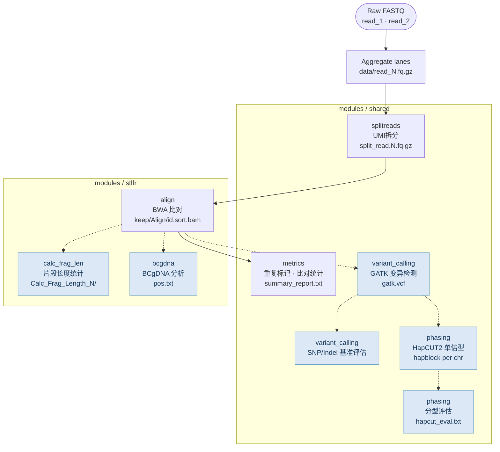
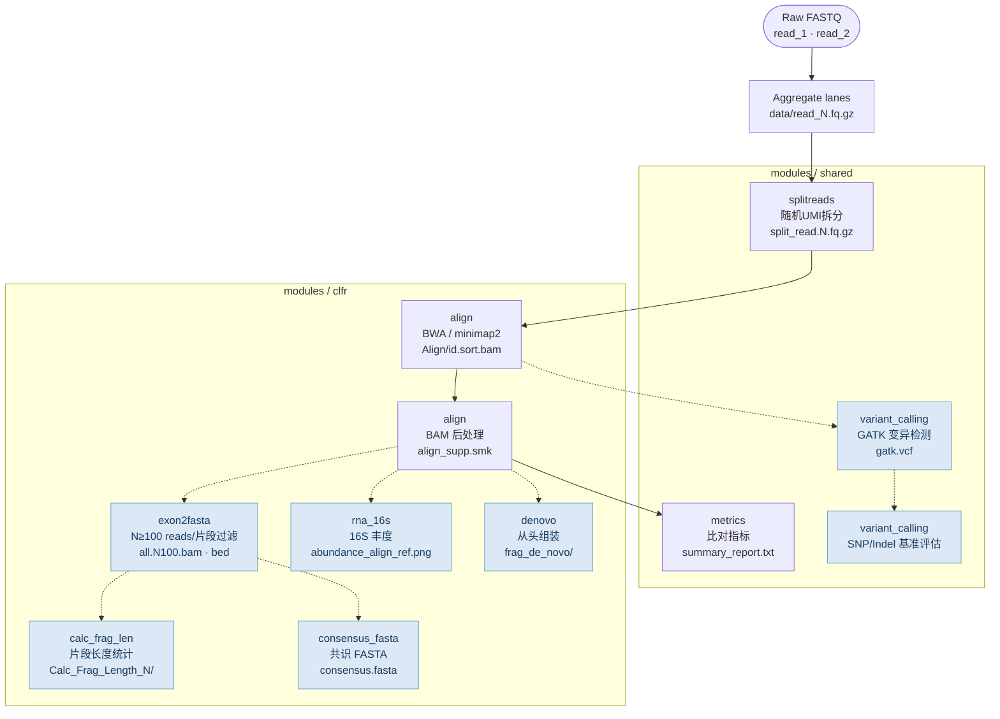

# CGI LFR 测序数据质控与分析流程

本流程适用于 CGI LFR 技术（stLFR：单管长片段读取；cLFR：Complete LFR）的各类 DNA 测序应用，重点关注**数据漂移质控/清洗/测序方案开发中的问题排查**。
生产环境流程请参见 [cWGS](https://github.com/Complete-Genomics/DNBSEQ_Complete_WGS/tree/test?tab=readme-ov-file)。

---

## 背景与意义

MGI stLFR/cLFR 技术通过UMI(条码)对短读长数据进行标记，实现基于UMI聚类的伪长读长分辨率，同时保持标准短读长成本。这使其在大规模全基因组测序（WGS）中极具吸引力，但也引入了额外的失效模式：建库漂移、UMI合成质量下降、测序化学试剂批次变化等均可在变异检测之前悄无声息地劣化数据质量。

**数据漂移监控对基于机器学习的变异检测至关重要。**
下游变异检测器（如 [Google DeepVariant](https://github.com/google/deepvariant)）是深度学习模型，其训练依赖特定分布的 reads pileup 特征——GC 含量、覆盖深度、重复率、片段大小等。当输入数据分布发生偏移（试剂批次更换、仪器重新校准），模型将在分布外（out-of-distribution）状态下运行，导致精确率/召回率下降，且在变异检测结果层面没有任何明显报错信号。

本流程针对每次测序运行计算一套结构化质控指标，以实现早期漂移检测：

| 指标 | 漂移信号 |
|---|---|
| 片段长度分布（N50、均值、变异系数） | 建库稳定性 |
| 每UMI读数分布 | UMI合成质量、碰撞率 |
| 唯一UMI占比 | UMI多样性、文库复杂度 |
| GC 偏好曲线（归一化覆盖度 vs GC%） | 测序化学 / PCR 偏差 |
| 重复率（Picard MarkDuplicates） | 过度扩增、插入片段大小偏移 |
| N≥100 reads/片段过滤通过率（cLFR） | cLFR 聚类效率 |
| 比对率、错配率 | 参考基因组兼容性、接头污染 |

这些指标具有双重用途：**运维质控**（在数据进入变异检测队列前进行拦截）和**特征工程**（作为漂移检测器的输入特征，或作为自动触发 DeepVariant 在漂移分布新标注数据上微调的信号）。

**多阶段数据清洗**
原始测序数据包含多种噪声来源，必须在下游分析或机器学习建模之前系统性地去除。本流程实现了分层清洗策略，与标准机器学习数据预处理高度对应：

| 阶段 | 问题 | 清洗方法 | 模块 |
|---|---|---|---|
| UMI提取 | 10-mer UMI中存在 1–2 bp 合成错误 | 针对UMI白名单进行 Hamming 距离≤1 的模糊匹配；无法解析的读数归入 null UMI | `shared/splitreads` |
| 去重 | PCR 扩增产生相同读数副本，虚增片段计数和覆盖度 | Picard MarkDuplicates 基于比对位置 + UMI标记重复；重复读数标记保留（不删除），以便下游分布检查 | `shared/metrics` |
| 低质量比对过滤 | 多位置比对及低质量比对在片段边界估计中引入噪声 | MAPQ ≥ 30（stLFR）/ 基于UMI分组 MAPQ ≥ 0（cLFR）；去除 supplementary 和 secondary 比对 | `stlfr/align`, `clfr/align` |
| UMI碰撞过滤（cLFR） | 两个不同 DNA 片段偶然共享同一UMI，产生嵌合伪片段 | N ≥ 100 reads/UMI过滤（`exon2fasta`）：在生日悖论模型下，超过该阈值碰撞概率低于 1% | `clfr/exon2fasta` |
| GC 偏好校正 | 测序化学对富含 AT 或 GC 的区域采样不足，扭曲覆盖深度 | 每 500 bp GC 区间拟合归一化覆盖曲线；校正后覆盖度用于所有下游深度计算 | `shared/metrics` |
| 片段边界校验 | 跨越结构变异或插入片段大小不一致的读对产生错误片段定义 | 应用片段长度边界（可配置 `min_frag`）；不一致读对排除在片段长度统计之外 | `stlfr/calc_frag_len`, `clfr/calc_frag_len` |

每个清洗步骤的清洗前后计数均记录在 `summary_report.txt` 中，提供可审计的清洗记录——与机器学习特征存储中的数据清洗溯源日志直接对应。

**高维数据结构**
本流程自然生成多种高维数据表示，可直接接入超出简单阈值质控范围的机器学习方法：

- **运行 × 指标矩阵** — 每次运行的质控向量（仅 GC 偏好曲线即为约 100 维；结合片段长度统计、UMI利用率、重复率，每次运行可产生约 200 维特征向量）。跨生产运行的矩阵是多元漂移检测的输入：PCA 投影暴露系统性仪器或试剂漂移；Isolation Forest 或自编码器在无需标注失败样本的情况下标记异常运行。

- **片段 × 特征矩阵（stLFR/cLFR）** — 每个UMI标识一个 DNA 片段。对于数百万片段，流程计算：读数计数、GC 含量、覆盖均匀性（位置 bin 间变异系数）、片段长度和比对质量统计。这个稀疏高维矩阵可用于训练片段质量分类器（真实片段 vs.UMI碰撞 artifact vs. 嵌合连接）。

- **片段 × 基因组 bin 覆盖张量（cLFR）** — 经过 N≥100 reads/片段过滤（`exon2fasta` 模块）后，每个通过片段在其基因组跨度上具有覆盖深度向量。叠加后得到片段 × bin 矩阵，适合用 NMF 或深度自编码器发现片段覆盖均匀性中的潜在模式。

- **单倍型 block 矩阵（stLFR）** — HapCUT2 输出每条染色体的单倍型 block，编码哪些变异等位基因共存于同一 DNA 分子。完整分型结果是变异 × 单倍型二值矩阵；其秩和稀疏性模式反映了底层杂合性以及片段长度/覆盖深度，是文库性能的高维读出。

**基于UMI的共识序列组装新方法（`clfr/consensus_fasta`）。**
从 cLFR 数据中恢复全长序列的传统方法依赖每个UMI分组的从头组装（SPAdes/MEGAHIT），在大规模应用中计算开销极高：每个UMI均需独立进行图构建、纠错和 contig 延伸。本流程引入了一种基于共识序列的替代方案，以大幅更低的计算成本实现相当的序列恢复效果。

核心思路在于：共享同一 UMI的 reads 来源于同一 DNA 分子，因此具有相同的底层序列。`consensus_fasta` 模块不通过图组装从头重建序列，而是将同一UMI组内所有 reads 比对到参考锚定序列，逐位置调用多数投票共识，并在输入 SQANTI3 进行 isoform 分类前校正链方向 artifact（`fixRC` 步骤）。这将逐片段组装从 NP-hard 图问题转化为线性时间的 pileup 操作：

| | 从头组装（`denovo`） | 共识序列组装（`consensus_fasta`） |
|---|---|---|
| 算法 | de Bruijn 图（SPAdes/MEGAHIT） | 参考引导 pileup + 多数投票 |
| 每片段计算量 | O(n² · k) 图构建 | O(n · L) 比对 pileup |
| 需要参考序列 | 否 | 是 |
| 处理新颖序列 | 是 | 否 |
| 主要应用场景 | 新颖 / 非参考序列 | 已知转录本、isoform 质控 |

对于 cLFR mRNA 应用——片段比对到已知转录本，目标是 isoform 级别质控而非新颖序列发现——共识方法以约 **更低的计算成本**实现等效的 isoform 检测，使常规的逐运行 isoform 分析成为可能，而从头组装方案在此场景下代价过高。

---

## ML 扩展

本流程的结构化输出专为下游机器学习系统设计。已实现及规划中的扩展：

### 已实现
- **运行级质控特征矩阵** — `summary_report.py` 汇总每次运行的指标向量（片段 N50、GC 偏好系数、重复率、UMI利用率），可作为下游建模特征值。

### 进行中
- **自适应漂移检测与自动微调** (`ml/agentic_finetune/`) — 端到端闭环系统：当漂移检测器（基于运行级质控特征矩阵的 MMD/CUSUM 检验）判定输入数据分布已偏离 DeepVariant 训练分布时，自动触发模型微调流程。整体架构分为三个阶段：
  1. **漂移判定**：对最近 N 次运行的质控向量进行滑动窗口 MMD 检验；当 p-value 低于阈值时标记漂移事件，并输出漂移方向（GC 偏移、片段长度漂移、重复率异常等）的特征归因。
  2. **Agentic 决策**：基于 LLM agent 的决策层评估漂移严重程度与历史微调记录，决定动作——跳过（噪声波动）、仅告警（轻度漂移）、或触发微调（显著漂移）。决策依据包括：漂移幅度、受影响指标类型、距上次微调的间隔、当前可用标注数据量。
  3. **自动微调**：按照 DeepVariant [training case study](https://github.com/IntelLabs/open-omics-deepvariant/blob/r1.5/docs/deepvariant-training-case-study.md) 的 transfer learning 方法，从预训练 WGS 模型出发，在漂移分布数据上执行 `make_examples`（基于 GIAB 基准集按染色体划分 train/val/test）→ shuffle → `model_train`（inception_v3 微调）→ `model_eval` 流程；在验证集（chr21）上持续评估 checkpoint，选取最优模型，仅当测试集（chr20）F1 优于当前生产模型时才部署。

  该系统将传统的"检测→人工干预→重训练"周期从数天压缩到小时级，同时通过 agent 决策层避免对噪声波动的过度反应。
- **片段质量分类器** (`ml/fragment_classifier/`) — 弱监督 LightGBM 分类器，区分真实片段与UMI碰撞及嵌合连接 artifact。标签程序化生成：每个UMI读数计数符合泊松模型的片段为正样本，离群值为负样本；SHAP 特征重要性识别驱动 artifact 率的关键质控指标。
- **学习型 GC 偏好校正** — 用梯度提升回归替代 `GC_bias.py` 中的固定曲线校正，训练特征包括可比对性、重复元件含量、距端粒距离；以 HG001 均匀覆盖区域为基准评估。


---

## 目录结构

本流程基于 [CGI_WGS_pipeline](https://github.com/Complete-Genomics/CGI_WGS_Pipeline) 重构，扩展了 stLFR 数据的分析范围，同时支持新开发的 cLFR 数据。

```
CGI_LFR_pipeline/
│
├── workflows/              # 流程入口
│   ├── stlfr.smk           # stLFR 入口
│   └── clfr.smk            # cLFR 入口
│
├── modules/                # 规则与脚本按功能共位存放
│   ├── shared/             # stLFR 与 cLFR 共用模块
│   │   ├── splitreads/     # UMI拆分（stLFR + cLFR）
│   │   ├── metrics/        # 比对指标、GC 偏好、汇总报告
│   │   ├── variant_calling/# GATK 变异检测
│   │   ├── phasing/        # HapCUT2 单倍型分析（stLFR）
│   ├── stlfr/              # stLFR 专用模块
│   │   ├── align/          # BWA 比对
│   │   ├── calc_frag_len/  # 片段长度统计
│   │   └── bcgdna/         # BCgDNA 故障检测
│   └── clfr/               # cLFR 专用模块
│       ├── align/          # BWA / minimap2 比对
│       ├── calc_frag_len/  # 片段长度统计
│       ├── exon2fasta/     # N≥100 reads 过滤 + 覆盖分析
│       ├── consensus_fasta/# mRNA isoform 共识序列
│       ├── rna_16s/        # 16S rRNA 丰度分析
│       └── denovo/         # 逐片段从头组装
│
├── config/
│   ├── stlfr.yaml          # stLFR 默认配置
│   └── clfr.yaml           # cLFR 默认配置
│
└── example/
    ├── fastq/batch_name/   # 原始 FASTQ 数据
    └── analysis/config.yaml
```

---

## 流程图

两条流程共享相同的读数处理入口，在比对阶段分叉。节点按 `modules/` 子目录分组，蓝色节点为可选模块，通过配置文件开关控制。

### stLFR 流程

入口：`workflows/stlfr.smk` · 配置：`config/stlfr.yaml`



### cLFR 流程

入口：`workflows/clfr.smk` · 配置：`config/clfr.yaml`



---

## 快速开始

1. 修改配置文件（`config/stlfr.yaml` 或 `config/clfr.yaml`）
2. 执行 `bash run_lfr.sh`

---


## 参考资料
1. [stLFR 论文](https://www.ncbi.nlm.nih.gov/pmc/articles/PMC6499310/) — DNA 共UMI技术
2. [cWGS（stLFR 生产流程）](https://github.com/Complete-Genomics/DNBSEQ_Complete_WGS/tree/test?tab=readme-ov-file) — 基于深度学习的变异检测
3. [HapCUT2](https://github.com/vibansal/HapCUT2) — 单倍型组装工具
